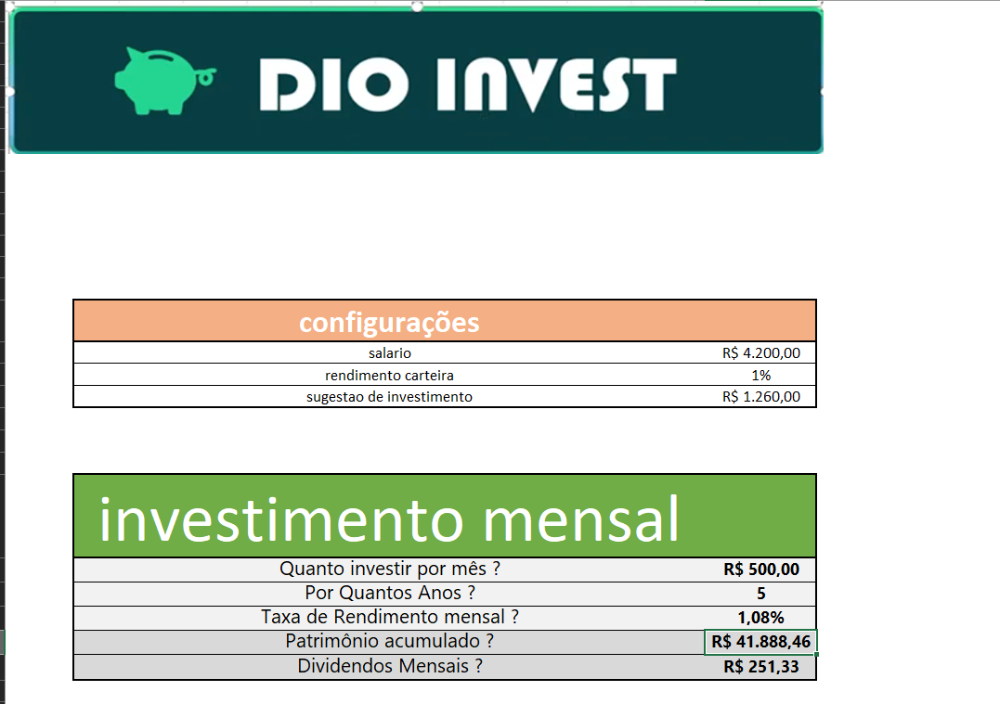
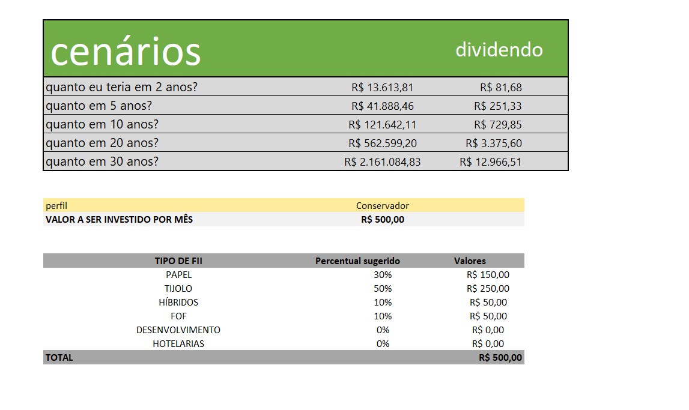

# 📊 Simulador de Investimentos em Fundos Imobiliários (FIIs)

Este projeto consiste em uma ferramenta prática de simulação de investimentos desenvolvida em Excel. O objetivo é auxiliar investidores a projetarem o crescimento de seu patrimônio e a geração de renda passiva (dividendos) ao longo do tempo, facilitando a tomada de decisão baseada em dados.

## 📝 Descrição do Projeto

O simulador permite que o usuário insira variáveis fundamentais do mercado financeiro e visualize, de forma automatizada, o comportamento do investimento. A planilha resolve cálculos complexos de juros compostos e reinvestimento de dividendos, proporcionando uma visão clara do futuro financeiro.

### Principais Funcionalidades:
* **Cálculo de Patrimônio Acumulado:** Projeção do valor total investido somado à valorização e rendimentos.
* **Estimativa de Dividendos Mensais:** Cálculo de quanto o investidor receberá de "aluguel" mensal com base no Yield informado.
* **Análise de Tempo vs. Rendimento:** Simulação de diferentes cenários temporais para alcançar a liberdade financeira.
* **Automação Financeira:** Fórmulas que atualizam os resultados instantaneamente ao alterar os aportes mensais.

## 🚀 Tecnologias e Conceitos Utilizados

Para a construção desta ferramenta, foram aplicados os seguintes conhecimentos:

* **Matemática Financeira:** Juros compostos, taxa de rendimento (DY) e cálculo de aportes constantes.
* **Fórmulas de Excel:** Uso de funções financeiras e lógicas para automação dos dados.
* **Formatação Condicional:** Para destacar metas atingidas ou variações importantes.
* **Design de Dashboard:** Organização visual para facilitar a leitura dos indicadores de performance.

## 📈 Como utilizar o simulador

1.  **Aporte Inicial:** Insira o valor que você possui para começar.
2.  **Aporte Mensal:** Defina quanto pretende investir todos os meses.
3.  **Taxa de Rendimento (Yield):** Insira a taxa média mensal esperada dos FIIs.
4.  **Período:** Defina a quantidade de meses ou anos da simulação.
5.  **Resultado:** A planilha calculará automaticamente o seu patrimônio final e sua renda passiva mensal estimada.

## 📂 Estrutura do Repositório

* `/src`: Contém o arquivo `.xlsx` do simulador.
* `/assets`: Capturas de tela (screenshots) da planilha em funcionamento.
* `README.md`: Documentação detalhada do projeto.

---

## 👨‍💻 Autor

Desenvolvido por **Pedro Augusto** como parte do desafio de projeto na **DIO (Digital Innovation One)**.

